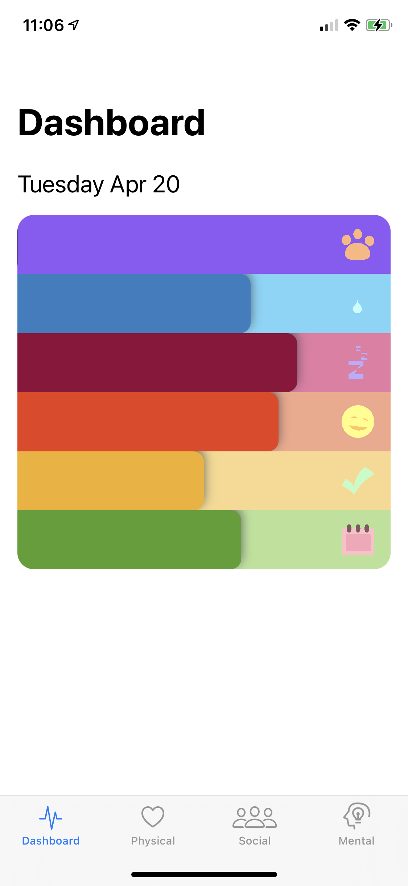

# WildcatWellness
iOS Hackathon project focused on student wellbeing.

## Motivation

This project was done for a weekend Hackathon in college. The theme of the hackathon was health and wellness. Worked in a team of 3 (one teammate responsible for design, another responsible for content and I was doing the coding). We decided to tackle the task by breaking down the idea of wellness into 3 categories, physcial, social and mental wellbeing. In these categories, the students could set goals that they believed would be good for them and the application would help keep track of it. 

## Screenshots

  
  
  
  

## Architecture

Application was built using the MVC architecture.

## Tech and Frameworks

All programming was done in Swift. The user interface was built programmatically using UIKit. The Bar Charts were built using Core Animation so that they could have the style that the designer had envisioned. The application is integrated with HealthKit to leverage some of the device's capabilities and automatically get data like step count instead of always relying on the student to enter the data. There is also ARKit integration which was used for the AR Exercises feature.
